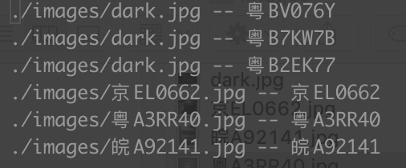
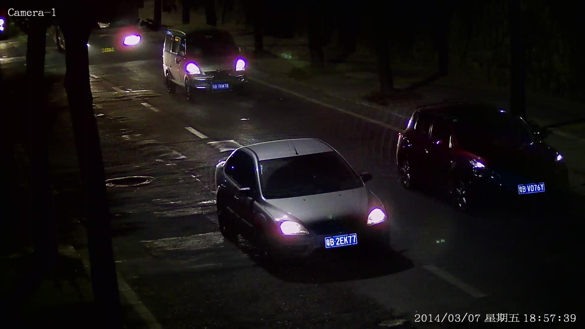

cnn + lstm + ctc for unconstrained lpr
=========
[](#contributors)

- This repo contains code and demo for chinese licence plate recognition(lpr) using cnn and lstm.

- This repo is heavily inspired by [HyperLPR](https://github.com/zeusees/HyperLPR), increased accuracy in wild environment.

- Please star if it's useful for you.

Feature
---------
- end to end, no need to split word

- in the wild, accuracy is around 96.6%

TODO
---------
- multi-line recognition

- more trainning data, especially for oblique data

- licence plate detection accuracy using yolo3/SSD with more data.


Data
---------
I did't found much useful data for both detection and recognition, one of the best is [功能车牌图像库数据](http://www.openits.cn/openData/index.jhtml)

We will thankful if you share some infomation.


Train
---------
```python
python main.py --mode train --train_dir 'your_trainning_data_dir' --val_dir 'validation_dir'
```

Test
---------
```python
python main.py --mode infer --infer_dir 'your_test_data_dir' --restore 
```

API
---------
```python
python api.py 
```

API Test
---------
```bash
curl -F "image=@/Users/alvenchen/Downloads/lp1.jpg"  http://127.0.0.1:8088/PlateRec
```


Result
---------


 

 


